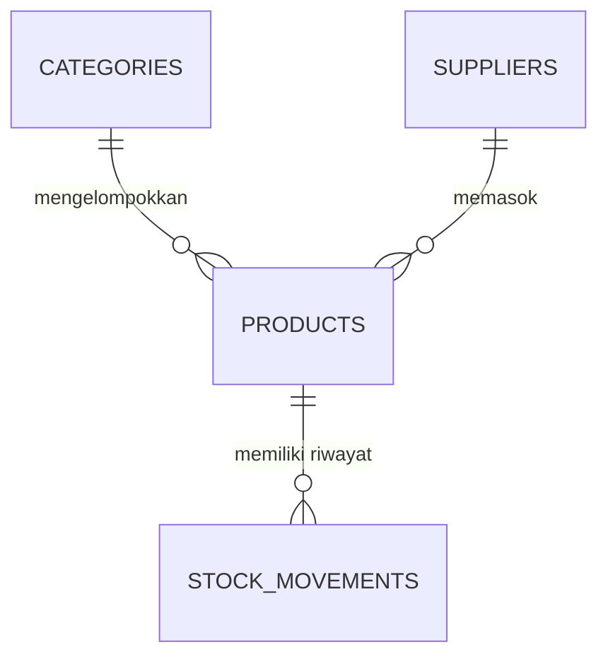

# Rakit - Sistem Persediaan Perlengkapan Elektronik

Aplikasi persediaan sederhana dengan frontend HTML/CSS/JavaScript dan backend Node.js tanpa paket tambahan. Data disimpan di Supabase PostgreSQL.

## Struktur

```text
index.html
.gitignore
frontend/
  index.html
  styles.css
  app.js
backend/
  app.js
  schema.sql
  public_readonly.sql
docs/
  skema-persediaan.md
README.md
```

## ERD | Peta Relasi Data

> **CIRCUIT MAP / 04 ENTITAS / 03 RELASI**  
> `products` menjadi simpul utama yang menghubungkan klasifikasi, pemasok, dan jejak pergerakan stok.



| Entitas | Primary key | Foreign key dan aturan penting | Fungsi |
| --- | --- | --- | --- |
| `categories` | `id` (`uuid`) | `name` wajib dan unik. | Mengelompokkan jenis perlengkapan. |
| `suppliers` | `id` (`uuid`) | `name` wajib dan unik. | Menyimpan identitas serta kontak pemasok. |
| `products` | `id` (`uuid`) | `category_id` → `categories.id`; `supplier_id` → `suppliers.id`; `sku` unik. | Menyimpan katalog, harga, saldo stok, dan batas minimum. |
| `stock_movements` | `id` (`uuid`) | `product_id` → `products.id`; jenis `in`/`out`; jumlah positif. | Menyimpan riwayat perubahan stok. |

### Cara Membaca Relasi

- **Kategori → Barang (1:N):** satu kategori dapat berisi banyak barang; setiap barang wajib memiliki satu kategori.
- **Pemasok → Barang (1:N):** satu pemasok dapat memasok banyak barang; setiap barang wajib memiliki satu pemasok.
- **Barang → Mutasi (1:N):** satu barang dapat memiliki banyak catatan mutasi; setiap catatan mutasi mengacu pada satu barang.
- Kategori dan pemasok tidak terhubung langsung. `products` menjadi penghubungnya.

Fungsi database `record_stock_movement` memperbarui saldo dan menyimpan riwayat dalam satu transaksi. Mutasi keluar ditolak jika jumlahnya melebihi stok yang tersedia. [Lihat dokumentasi skema lengkap](docs/skema-persediaan.md).

## Menyiapkan Supabase

1. Buat proyek Supabase PostgreSQL.
2. Buka **SQL Editor**, lalu jalankan isi [backend/schema.sql](backend/schema.sql).
3. Dari proyek yang sama, salin **Project URL** melalui dialog **Connect**. Backend lokal menggunakan key **Secret** (`sb_secret_...`) atau legacy **service_role** (`eyJ...`). Key `publishable` hanya digunakan oleh frontend GitHub Pages dengan kebijakan baca-saja; jangan gunakan secret di frontend atau GitHub.

## Menjalankan aplikasi

Gunakan Node.js 18 atau lebih baru. Buka PowerShell di folder proyek, isi URL dengan Project URL milik Anda, lalu masukkan secret key saat diminta. Input key disembunyikan oleh PowerShell.

```powershell
$env:SUPABASE_URL = "https://PROJECT-REF.supabase.co"
$secureKey = Read-Host "Masukkan Supabase secret/service_role key" -AsSecureString
$env:SUPABASE_SERVICE_ROLE_KEY = [System.Net.NetworkCredential]::new("", $secureKey).Password
node .\backend\app.js
```

Jika Node terpasang di `D:\node.exe` dan perintah `node` belum dikenali, gunakan `D:\node.exe .\backend\app.js` pada baris terakhir. Buka `http://localhost:3000` di browser. URL dan key harus berasal dari proyek Supabase yang sama. Untuk menghentikan server, tekan `Ctrl+C` pada terminal.

## Publikasi GitHub Pages (Baca Saja)

GitHub Pages hanya menyajikan berkas frontend. Pada domain `github.io`, aplikasi membaca Supabase secara langsung dengan key `publishable`; penambahan dan perubahan data tetap dilakukan lewat backend lokal.

> **Perhatian privasi:** setelah kebijakan baca-publik diaktifkan, siapa pun yang membuka situs dapat melihat nama barang, stok, harga satuan, nama pemasok, dan catatan mutasi. Jangan publikasikan data yang bersifat rahasia.

1. Di proyek Supabase yang sama, buka **SQL Editor** dan jalankan isi [backend/public_readonly.sql](backend/public_readonly.sql). Skrip ini hanya memberi peran publik izin `SELECT` pada kolom yang diperlukan; tidak memberi izin menulis.
2. Pastikan key `sb_publishable_...` di `frontend/app.js` adalah key publishable dari proyek tersebut. Key publishable memang dirancang untuk tampil di browser; jangan pernah menggantinya dengan `sb_secret_` atau `service_role`.
3. Commit dan push berkas proyek ke GitHub.
4. Di repositori GitHub, buka **Settings → Pages**. Pilih **Deploy from a branch**, pilih branch yang berisi berkas proyek, lalu pilih folder **/(root)** dan simpan.
5. Buka alamat Pages yang diberikan GitHub, biasanya `https://<username>.github.io/<nama-repositori>/`. Beranda root akan meneruskan ke frontend.

Situs Pages bersifat publik dan hanya-baca. Jangan menaruh secret Supabase di repository. `.gitignore` membantu mencegah file environment lokal ikut ter-commit.

## Alur awal

1. Buka **Data referensi** untuk menambah kategori dan pemasok.
2. Pilih **Barang baru** untuk mencatat perlengkapan.
3. Gunakan **Catat mutasi** untuk menambah atau mengurangi stok.

Tidak diperlukan `package.json`, file `.env`, maupun `.env.example`.
